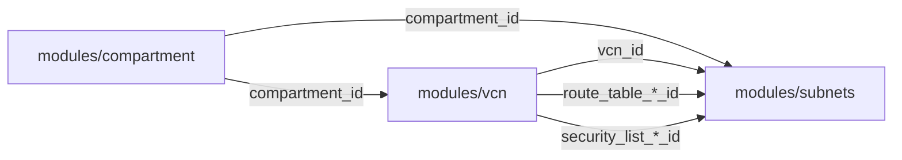

# Module: Subnets

Creates a public and private subnet pair within an existing VCN. Each subnet is associated with its own route table and security list for network isolation.

## Usage

```hcl
module "subnets" {
  source = "git::ssh://git@github.com/andriocampos/terraform-oci-modules.git//modules/subnets?ref=v1.0.0"

  compartment_id      = module.compartment.id
  vcn_id              = module.vcn.vcn_id
  public_subnet_cidr  = "10.50.1.0/24"
  private_subnet_cidr = "10.50.11.0/24"

  route_table_public_id    = module.vcn.route_table_public_id
  route_table_private_id   = module.vcn.route_table_private_id
  security_list_public_id  = module.vcn.security_list_public_id
  security_list_private_id = module.vcn.security_list_private_id

  freeform_tags = {
    project    = "portfolio-sre"
    managed_by = "terraform"
  }
}
```

## Inputs

| Name | Type | Required | Default | Description |
|------|------|:--------:|---------|-------------|
| `compartment_id` | `string` | ✅ | — | Compartment OCID |
| `vcn_id` | `string` | ✅ | — | VCN OCID where subnets will be created |
| `public_subnet_cidr` | `string` | ✅ | — | CIDR for public subnet (e.g., `10.50.1.0/24`) |
| `private_subnet_cidr` | `string` | ✅ | — | CIDR for private subnet (e.g., `10.50.11.0/24`) |
| `public_subnet_name` | `string` | ❌ | `"subnet-pub-core"` | Public subnet display name |
| `private_subnet_name` | `string` | ❌ | `"subnet-pvt-core"` | Private subnet display name |
| `public_subnet_dns_label` | `string` | ❌ | `"pubcore"` | Public subnet DNS label |
| `private_subnet_dns_label` | `string` | ❌ | `"pvtcore"` | Private subnet DNS label |
| `route_table_public_id` | `string` | ✅ | — | Route table OCID for public subnet |
| `route_table_private_id` | `string` | ✅ | — | Route table OCID for private subnet |
| `security_list_public_id` | `string` | ✅ | — | Security list OCID for public subnet |
| `security_list_private_id` | `string` | ✅ | — | Security list OCID for private subnet |
| `freeform_tags` | `map(string)` | ❌ | `{}` | Free-form tags to apply |

## Outputs

| Name | Type | Description |
|------|------|-------------|
| `public_subnet_id` | `string` | Public subnet OCID |
| `private_subnet_id` | `string` | Private subnet OCID |
| `public_subnet_cidr` | `string` | Public subnet CIDR block |
| `private_subnet_cidr` | `string` | Private subnet CIDR block |

## Resources Created

| Resource | Name | Public IP | Internet Ingress |
|----------|------|:---------:|:----------------:|
| `oci_core_subnet` | `subnet-pub-core` | ✅ Allowed | ✅ Allowed |
| `oci_core_subnet` | `subnet-pvt-core` | ❌ Blocked | ❌ Blocked |

## Public vs Private Subnet Behavior

| Property | Public Subnet | Private Subnet |
|----------|:-------------:|:--------------:|
| `prohibit_internet_ingress` | `false` | `true` |
| `prohibit_public_ip_on_vnic` | `false` | `true` |
| Instances get public IP | Yes (auto-assigned) | No |
| Direct internet access | Via IGW (in + out) | No (SGW only for OCI Services) |
| Typical workloads | Bastion, web server, LB | Database, backend, workers |

## CIDR Planning

This module expects CIDRs from within the parent VCN block. Example allocation:

```
VCN: 10.50.0.0/16 (65,536 IPs total)
│
├── 10.50.1.0/24   → subnet-pub-core  (251 usable IPs)
├── 10.50.11.0/24  → subnet-pvt-core  (251 usable IPs)
├── 10.50.2.0/24   → (available for future projects)
├── 10.50.3.0/24   → (available for future projects)
└── ...
```

> **Note:** OCI reserves 3 IPs per subnet (network, broadcast, DNS). A /24 provides 251 usable host addresses.

## Dependencies

This module requires outputs from the `vcn` module:



## Cost

**Free** — Subnets are free in OCI. No per-subnet charges or bandwidth fees within the same VCN.
