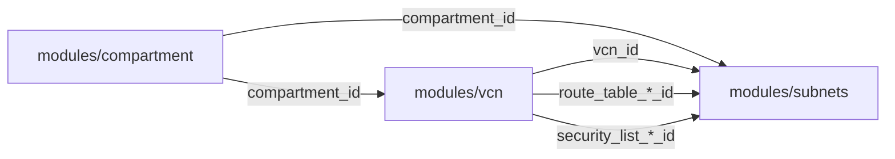

# Módulo: Subnets

Cria um par de subnets (pública e privada) dentro de uma VCN existente. Cada subnet é associada à sua própria route table e security list para isolamento de rede.

## Uso

```hcl
module "subnets" {
  source = "git::ssh://git@github.com/andriocampos/terraform-oci-modules.git//modules/subnets?ref=v1.0.0"

  compartment_id      = module.compartment.id
  vcn_id              = module.vcn.vcn_id
  public_subnet_cidr  = "10.50.1.0/24"
  private_subnet_cidr = "10.50.11.0/24"

  route_table_public_id    = module.vcn.route_table_public_id
  route_table_private_id   = module.vcn.route_table_private_id
  security_list_public_id  = module.vcn.security_list_public_id
  security_list_private_id = module.vcn.security_list_private_id

  freeform_tags = {
    project    = "portfolio-sre"
    managed_by = "terraform"
  }
}
```

## Entradas

| Nome | Tipo | Obrigatório | Padrão | Descrição |
|------|------|:-----------:|--------|-----------|
| `compartment_id` | `string` | ✅ | — | OCID do compartment |
| `vcn_id` | `string` | ✅ | — | OCID da VCN onde as subnets serão criadas |
| `public_subnet_cidr` | `string` | ✅ | — | CIDR da subnet pública (ex: `10.50.1.0/24`) |
| `private_subnet_cidr` | `string` | ✅ | — | CIDR da subnet privada (ex: `10.50.11.0/24`) |
| `public_subnet_name` | `string` | ❌ | `"subnet-pub-core"` | Nome da subnet pública |
| `private_subnet_name` | `string` | ❌ | `"subnet-pvt-core"` | Nome da subnet privada |
| `public_subnet_dns_label` | `string` | ❌ | `"pubcore"` | Label DNS da subnet pública |
| `private_subnet_dns_label` | `string` | ❌ | `"pvtcore"` | Label DNS da subnet privada |
| `route_table_public_id` | `string` | ✅ | — | OCID da Route Table para subnet pública |
| `route_table_private_id` | `string` | ✅ | — | OCID da Route Table para subnet privada |
| `security_list_public_id` | `string` | ✅ | — | OCID da Security List para subnet pública |
| `security_list_private_id` | `string` | ✅ | — | OCID da Security List para subnet privada |
| `freeform_tags` | `map(string)` | ❌ | `{}` | Tags de formato livre |

## Saídas

| Nome | Tipo | Descrição |
|------|------|-----------|
| `public_subnet_id` | `string` | OCID da subnet pública |
| `private_subnet_id` | `string` | OCID da subnet privada |
| `public_subnet_cidr` | `string` | CIDR da subnet pública |
| `private_subnet_cidr` | `string` | CIDR da subnet privada |

## Recursos Criados

| Recurso | Nome | IP Público | Ingress Internet |
|---------|------|:----------:|:----------------:|
| `oci_core_subnet` | `subnet-pub-core` | ✅ Permitido | ✅ Permitido |
| `oci_core_subnet` | `subnet-pvt-core` | ❌ Bloqueado | ❌ Bloqueado |

## Comportamento: Subnet Pública vs Privada

| Propriedade | Subnet Pública | Subnet Privada |
|-------------|:--------------:|:--------------:|
| `prohibit_internet_ingress` | `false` | `true` |
| `prohibit_public_ip_on_vnic` | `false` | `true` |
| Instâncias recebem IP público | Sim (auto) | Não |
| Acesso direto à internet | Via IGW (entrada + saída) | Não (apenas SGW para OCI Services) |
| Workloads típicos | Bastion, web server, LB | Banco de dados, backend, workers |

## Planejamento de CIDR

Este módulo espera CIDRs dentro do bloco da VCN pai. Exemplo de alocação:

```
VCN: 10.50.0.0/16 (65.536 IPs total)
│
├── 10.50.1.0/24   → subnet-pub-core  (251 IPs utilizáveis)
├── 10.50.11.0/24  → subnet-pvt-core  (251 IPs utilizáveis)
├── 10.50.2.0/24   → (disponível para projetos futuros)
├── 10.50.3.0/24   → (disponível para projetos futuros)
└── ...
```

> **Nota:** A OCI reserva 3 IPs por subnet (rede, broadcast, DNS). Um /24 fornece 251 endereços utilizáveis.

## Dependências

Este módulo requer outputs do módulo `vcn`:



## Custo

**Gratuito** — Subnets são gratuitas na OCI. Sem cobrança por subnet ou tráfego dentro da mesma VCN.
